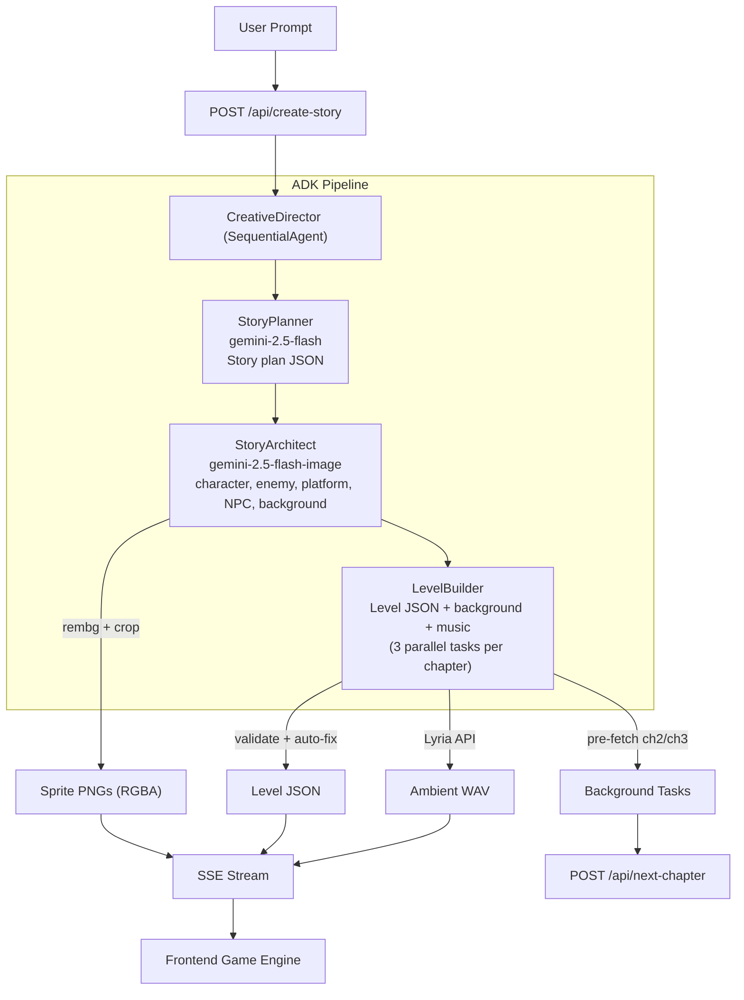

# Playable Storybook — Backend

> A Creative Director AI Agent that transforms a single sentence into a complete, playable 2D platformer game with AI-generated art, music, and level design.

**Hackathon Category:** Creative Storyteller — Multimodal Storytelling with Interleaved Output

**Live URL:** https://playable-storybook-rb454rmsjq-uc.a.run.app

---

## What It Does

Type one sentence. Get a playable game.

```
"A tiny astronaut exploring candy planets"
  → flat vector art, laser combat, candy-themed enemies,
    ambient music, 3 unique chapters with escalating difficulty
```

The backend orchestrates a **3-agent ADK pipeline** that generates:
- **Story plan** — title, premise, 3 chapters with missions, mechanics, difficulty
- **5 game sprites** — hero, enemy, platform, NPC, background (parallel Gemini calls + rembg)
- **Level layouts** — platforms, enemies, pickups, hazards, physics, missions (validated + auto-fixed)
- **NPC voice** — dialogue TTS via Gemini (multilingual: Hindi, Russian, etc.; English default)
- **Ambient music** — per-chapter loops via Lyria on Vertex AI
- **Chapter backgrounds** — unique per chapter

Everything streams to the frontend in real-time via SSE.

---

## Architecture



### Creative Director

**Creative Director** is the top-level SequentialAgent that orchestrates the full pipeline. It does not call the LLM itself — it runs three sub-agents in order and passes session state between them. Each sub-agent writes its output (e.g. `story_plan`, `story_pack`, `level_data`) for the next to consume.

### Agent Pipeline

| Agent | Model | Output | Time |
|-------|-------|--------|------|
| **StoryPlanner** | `gemini-2.5-flash` | Story plan JSON (title, 3 chapters, characters, mechanics) | ~2-3s |
| **StoryArchitect** | `gemini-2.5-flash-image` | 5 game assets via `generate_assets` tool | ~15-25s |
| **LevelBuilder** | `gemini-2.5-flash` + `gemini-2.5-flash-image` + Lyria + TTS | Level JSON, chapter backgrounds, ambient music, NPC voice | ~8-10s per chapter |

### Google Models Used

| Model | API | Purpose |
|-------|-----|---------|
| `gemini-2.5-flash` | Gemini API | Story planning, agent orchestration, level JSON |
| `gemini-2.5-flash-image` | Gemini API | Sprites (5 assets), chapter backgrounds |
| `gemini-2.5-flash-preview-tts` | Gemini API | NPC dialogue audio |
| `lyria-002` | Vertex AI | Ambient music per chapter |

### Key Design Decisions

- **Data-driven engine** — The frontend has a fixed set of mechanics (gravity, jump, combat, missions). The agent chooses which to use per story (e.g. space → low gravity + laser; fairy → double jump + fog).
- **5 parallel Gemini calls** for sprites — prevents first-in-batch scene compositing; semaphore limits concurrency to 3.
- **rembg + Pillow** for sprites — Sprites generated on white `#FFFFFF` background so rembg (U2Net) can segment and remove it. Pillow then alpha-threshold crops to trim transparent padding.
- **Background tiling** — Chapter backgrounds are prompted with "seamless horizontal tile for parallax" so they can be tiled for infinite parallax scroll without visible seams.
- **Level validator** — 9 automated checks + auto-fixes guarantee playable levels from imperfect AI output.
- **Chapter pre-fetching** — chapters 2/3 generate in background while player plays chapter 1.

---

## API Endpoints

| Method | Path | Description |
|--------|------|-------------|
| `POST` | `/api/create-story` | Start the full pipeline. Body: `{"prompt": "..."}`. Returns SSE stream. |
| `POST` | `/api/next-chapter` | Get level data for a chapter. Body: `{"session_id": "...", "chapter_number": 2}` |
| `GET` | `/api/assets/{path}` | Serve generated assets (images, audio, JSON) |
| `GET` | `/health` | Health check |

### SSE Events (from `/api/create-story`)

| Event | Data | When |
|-------|------|------|
| `session` | `{session_id}` | Pipeline starts |
| `story_plan` | Full story plan JSON | StoryPlanner completes |
| `image` | `{role, url}` | Each sprite generated |
| `level_ready` | `{level_json, background_url, music_url}` | Chapter ready (text first; NPC audio streams later) |
| `npc_audio` | `{npc, line_index, audio_url}` | Each NPC dialogue line TTS ready (progressive) |
| `audio` | `{role, url}` | Music generated |
| `complete` | `{}` | Pipeline done |

### NPC Voice (Frontend Contract)

**Dialogue line structure** (in `level_json.npcs[].dialogue[]`):
```json
{ "speaker": "Peppermint Elder", "text": "Welcome, little one!", "audio_url": "/api/assets/{session_id}/npc_peppermint_elder_1_0.wav" }
```
- `audio_url` is optional; if absent, render text-only. When present, play via `new Audio(audio_url)`.

**Progressive streaming:** The `level_ready` event is sent immediately (dialogue may not have `audio_url` yet). As each NPC line is synthesized, an `npc_audio` event is streamed:
```json
{ "npc": "Peppermint Elder", "line_index": 0, "audio_url": "/api/assets/.../npc_peppermint_elder_1_0.wav" }
```
- Frontend: on `npc_audio`, find the dialogue line (by npc name + line_index) and set `audio_url`. Optionally preload `new Audio(audio_url)`.

---

## Quick Start (Local)

### Prerequisites

- Python 3.12+
- A Gemini API key from [aistudio.google.com/apikey](https://aistudio.google.com/apikey)

### Setup

```bash
git clone https://github.com/Rahul-sinha84/mirror-land-backend.git
cd mirror-land-backend

python -m venv .venv
source .venv/bin/activate

pip install -r requirements.txt

cp .env.example .env
# Edit .env and add your GOOGLE_API_KEY
```

### Run

```bash
uvicorn main:app --host 0.0.0.0 --port 8080 --reload
```

### Test

```bash
# Health check
curl http://localhost:8080/health

# Generate a story (SSE stream)
curl -N -X POST http://localhost:8080/api/create-story \
  -H 'Content-Type: application/json' \
  -d '{"prompt": "A tiny pirate searching for cursed treasure"}'
```

### Run individual services

```bash
# Story planner only
python tests/test_story_planner.py

# Image generation + sprite cleaning
python tests/test_image_gen.py

# Level generation + validation
python tests/test_level_gen.py

# Music generation (requires GOOGLE_CLOUD_PROJECT)
python tests/test_music_gen.py

# TTS generation (requires GOOGLE_API_KEY)
python tests/test_tts_gen.py

# Full ADK pipeline
python tests/test_adk_pipeline.py
```

---

## Deploy to Google Cloud Run

### Prerequisites

- `gcloud` CLI installed and authenticated
- A GCP project with Cloud Run enabled

### Deploy

```bash
# Ensure .env has GOOGLE_API_KEY and GOOGLE_CLOUD_PROJECT
bash deploy.sh
```

This builds the Docker image, deploys to Cloud Run (2Gi RAM, 2 CPU, 300s timeout), and prints the public URL.

---

## Environment Variables

| Variable | Required | Description |
|----------|----------|-------------|
| `GOOGLE_API_KEY` | Yes | Gemini API key |
| `GOOGLE_CLOUD_PROJECT` | Optional | GCP project ID (for Lyria music generation) |
| `GOOGLE_CLOUD_LOCATION` | Optional | Vertex AI region (default: `us-central1`) |

---

## Project Structure

```
├── main.py                  # FastAPI app: SSE streaming + REST API
├── sse.py                   # Session queues + stream_to_client()
├── level_validator.py       # 9 checks + auto-fixes for level JSON
├── agent/
│   ├── agent.py             # ADK agents: CreativeDirector pipeline
│   ├── prompts.py           # Agent system prompts
│   └── tools.py             # ADK tools: generate_assets, generate_chapter_level
├── services/
│   ├── gemini_client.py     # Shared Gemini client
│   ├── image_gen.py         # 5 parallel Gemini calls for sprites + background
│   ├── sprite_cleaner.py    # rembg + alpha-threshold crop
│   ├── level_gen.py         # Level JSON + chapter background generation
│   ├── audio_gen.py         # Lyria music generation (Vertex AI)
│   ├── tts_gen.py           # NPC dialogue TTS (Gemini)
│   └── story_planner.py     # Story plan generation (standalone)
├── tests/                   # Per-service test scripts
├── static/assets/           # Generated assets (per session)
├── deploy.sh                # Cloud Run deployment script
├── Dockerfile               # Python 3.12-slim + rembg deps
└── requirements.txt
```

---

## Request Flow

1. **User enters prompt** → `POST /api/create-story` → SSE stream starts
2. **Backend** (hosted on Google Cloud Run) runs the ADK agent in-process
3. **Creative Director** orchestrates StoryPlanner → StoryArchitect → LevelBuilder
4. **Tools** push events to the SSE queue; frontend receives them in real time
5. **User advances chapter** → `POST /api/next-chapter` (returns cached or generates on demand)
6. **Assets** (images, audio) → `GET /api/assets/{session_id}/{filename}`

---

## Tech Stack

| Layer | Technology |
|-------|-----------|
| AI Agents | Google ADK (SequentialAgent, LlmAgent, tools) |
| AI Models | Gemini 2.5 Flash (text), Gemini 2.5 Flash Image (sprites, backgrounds), Gemini TTS (NPC voice), Lyria (ambient music) |
| Backend | Python + FastAPI |
| Streaming | SSE (Server-Sent Events) |
| Sprite Cleanup | rembg (U2Net ONNX) + Pillow (alpha-threshold crop) |
| Deploy | Google Cloud Run |
| Container | Docker (Python 3.12-slim) |

---

## Google Cloud Services Used

- **Gemini API** — Story planning, image generation, level design (via Google AI Studio key)
- **Vertex AI** — Lyria music generation (ambient loops per chapter)
- **Cloud Run** — Serverless deployment with auto-scaling (0-3 instances)
- **Cloud Build** — Docker image building (triggered by `gcloud run deploy --source .`)
